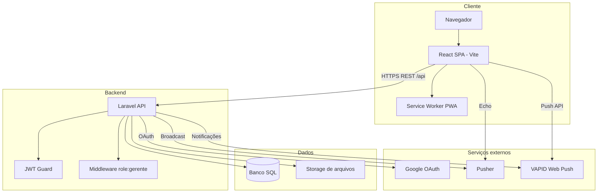

# Arquitetura

## Visão em camadas

## Fluxo de autenticação (resumo)

1. Login/registro → API retorna `access_token` (JWT).
2. Cliente armazena token (ex.: `localStorage`) e envia header `Authorization: Bearer`.
3. Em `401`, o cliente tenta `POST /api/auth/refresh` e repete a requisição.
4. Google: navegação para `GET /api/auth/google` (middleware `web` para sessão/state) → callback → redirecionamento ao frontend com token na query string.

## Middleware e políticas

| Camada | Função |
|--------|--------|
| `auth:api` | Garante JWT válido nas rotas protegidas. |
| `role:gerente` | Restringe a usuários com `tipo === gerente`. |
| Policies (ex.: `MediaPolicy`) | Autorização por recurso onde aplicável. |

## Frontend

- **Roteamento**: React Router; rotas públicas (`/`, `/login`) e privadas com `PrivateRoute` + `AppLayout`.
- **Estado servidor**: TanStack Query para cache de dados da API.
- **Auth**: `AuthContext` com usuário, token e flags `isGerente`.

## Complementos gerados

- Documentação de endpoints Scribe (se gerada): pastas `.scribe/` no projeto — útil como referência alternativa à tabela em [05-api-rest.md](05-api-rest.md).
