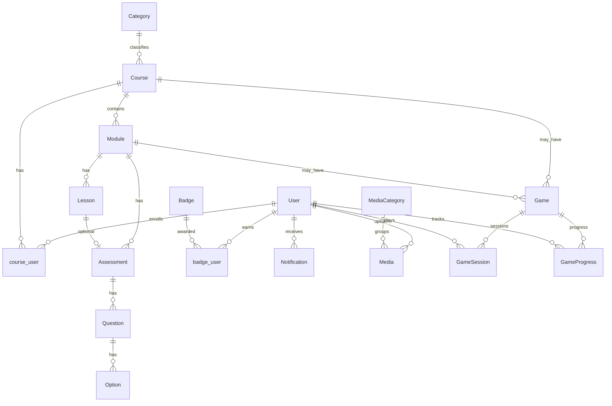

# Entidades e modelo de dados

## Modelos Eloquent (`app/Models/`)

| Modelo | Descrição |
|--------|-----------|
| `User` | Usuário; `tipo` (`aluno` \| `gerente`); relações com cursos, lições, avaliações, badges, notificações, mídias, sessões de jogo. |
| `Category` | Categoria de curso. |
| `Course` | Curso; pertence a `Category`; tem `Module`; N:N com `User` (matrícula). |
| `Module` | Módulo dentro do curso; tem `Lesson` e `Assessment`. |
| `Lesson` | Aula; conteúdo HTML/rich text; pertence a `Module`. |
| `Assessment` | Avaliação; pertence a `Module`; opcionalmente a `Lesson`; tem `Question`. |
| `Question` | Pergunta; pertence a `Assessment`; tem `Option`. |
| `Option` | Alternativa de múltipla escolha. |
| `Badge` | Medalha; N:N com `User` (pivot com contexto de curso/módulo). |
| `Notification` | Notificação do usuário. |
| `Game` | Minigame; `config` JSON; ligado a `Course` / `Module`. |
| `GameSession` | Sessão de jogo do usuário. |
| `GameProgress` | Progresso por jogo/usuário. |
| `Media` | Arquivo enviado; `user_id`, `media_category_id`, tipo MIME, URL. |
| `MediaCategory` | Categoria de biblioteca de mídias. |

## Diagrama ER simplificado

## Tabelas pivô / relacionamentos frequentes

- `course_user`: usuário ↔ curso (progresso, `completed_at`).
- `lesson_user`: lições concluídas.
- `assessment_user`: avaliações concluídas (pontuação).
- `badge_user`: medalhas com metadados (`course_id`, `module_id`, `earned_at`).

## Migrações

Localização: `database/migrations/`. Evolução do schema deve ser feita apenas via migrations versionadas.
